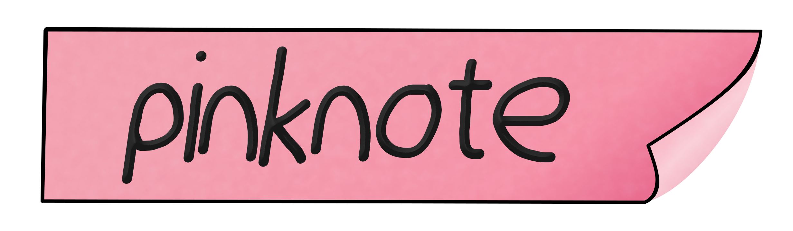

# pinknote

---

pinknote is a simple Markdown to HTML renderer, that includes simple CSS and JS templates to render a web-page, ready for deployment from just a markdown file. It comes with a basic light & dark theme mode, respects the users theme preference and is accessible via mobile.



#### why?

because I enjoyed it! :3 There are probably hundreds of such projects out there, but doing it myself was fun!

## Demo

This projects description is hosted at [pinknote.janamarie.dev](https://pinknote.janamarie.dev), compiled by pinknote!

## Usage

To generate a web-page you just need a Markdown file, render it via

    ./generate.py <Markdown>

With no additional paramets the HTML file will be put into `www/` and your assets into `www/assets/`. You can change this by passing the `-o <output-path>` parameter.

### Themes

To choose a different theme, a different CSS file you can use the option `-css static/css/<theme>.css`, thee following are currently inlcuded.

<table style="table-layout:fixed;">
<tbody>
  <tr style="">
    <th style="text-align:center;vertical-align:top" colspan="2"><a href="https://clean.pinknote.janamarie.dev"><h5>clean</h5></a></th>
    <th style="text-align:center;vertical-align:top" colspan="2"><a href="https://pinknote.pinknote.janamarie.dev"><h5>pinknote</h5></a></th>
    <th style="text-align:center;vertical-align:top" colspan="2"><a href="https://mint.janamarie.dev"><h5>mint</h5></a></th>
  </tr>
  <tr>
    <td style="width:16.66%;"></td>
    <td style="width:16.66%;"></td>
    <td style="width:16.66%;"></td>
    <td style="width:16.66%;"></td>
    <td style="width:16.66%;"></td>
    <td style="width:16.66%;"></td>
  </tr>
  <tr>
    <td style="text-align:center;vertical-align:bottom;text-style:block;" colspan="2">--css static/css/clean.css</td>
    <td style="text-align:center;vertical-align:bottom;text-style:block;" colspan="2">--css static/css/pinknote.css</td>
    <td style="text-align:center;vertical-align:bottom;text-style:block;" colspan="2">--css static/css/mint.css</td>
  </tr>
  <tr>
    <th style="text-align:center;vertical-align:top" colspan="2"><a href="https://sunset.pinknote.janamarie.dev"><h5>sunset</h5></a></th>
    <th style="text-align:center;vertical-align:top" colspan="2"><a href="https://code.pinknote.janamarie.dev"><h5>code</h5></a></th>
    <th style="text-align:center;vertical-align:top" colspan="2"><a href="https://banana.pinknote.janamarie.dev"><h5>banana</h5></a></th>
  </tr>
  <tr>
    <td style="width:16.66%;"></td>
    <td style="width:16.66%;"></td>
    <td style="width:16.66%;"></td>
    <td style="width:16.66%;"></td>
    <td style="width:16.66%;"></td>
    <td style="width:16.66%;"></td>
  </tr>
  <tr>
    <td style="text-align:center;vertical-align:bottom;text-style:block;" colspan="2">--css static/css/sunset.css</td>
    <td style="text-align:center;vertical-align:bottom;text-style:block;" colspan="2">--css static/css/code.css</td>
    <td style="text-align:center;vertical-align:bottom;text-style:block;" colspan="2">--css static/css/banana.css</td>
  </tr>
</tbody>
</table>

I would love to see more themes contributed! :3

## Files

```
  ./ 
    assets/         - Contains the Image files for this repo
    static/
      assets/       - Put your assets in here
      css/          - Themes, stylesheets
      index.js      - The light-dark theme selector, put your additional JS in here
    temlates/       - index.html template
  generate.py       - The generator itself, run this to render your Markdown file
  README.md         - This file
```

## Todo

 - [x] Set proper website title and meta var
 - [ ] Make JS package optional
